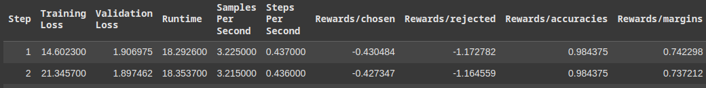
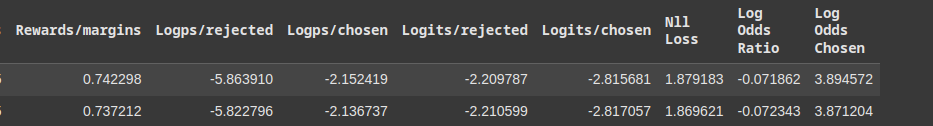

 
 

# `# ORPO: Odds Ratio Preference Optimization:`

 
 

# `#01: Our main target in orpo:`

Orpo traning এ আমাদের মূল target হলো, tranning loss কমানো, validation loss কমানো,  reward/margins বাড়ানো বা rewards/chosen and rewards/rejected এর পাথক্য বাড়ানো। reward accuries বাড়ানো।

আপনার প্রশ্নটি দুটি অংশে বিভক্ত:

1. **কোন হাইপারপ্যারামিটারগুলোর মান পরিবর্তন করে ট্রেনিং লস, ভ্যালিডেশন লস, রিওয়ার্ড মার্জিন, এবং অন্যান্য মেট্রিক্স উন্নত করা যায়**।
2. **হাইপারপ্যারামিটারগুলোর মধ্যে bias-variance trade-off সম্পর্ক**।

নিচে আমি এই দুটি অংশই বিস্তারিতভাবে ব্যাখ্যা করছি:

---

### **1. কোন হাইপারপ্যারামিটারগুলোর মান পরিবর্তন করে মেট্রিক্স উন্নত করা যায়?**

#### **ট্রেনিং লস এবং ভ্যালিডেশন লস কমানোর জন্য:**

| হাইপারপ্যারামিটার           | প্রভাব                                                                 | কিভাবে পরিবর্তন করবেন?                                                                 |
|-----------------------------|------------------------------------------------------------------------|---------------------------------------------------------------------------------------|
| **Learning Rate**           | লার্নিং রেট বেশি হলে মডেল converge করতে পারে না, কম হলে মডেল ধীরে শিখে। | লার্নিং রেট বাড়ান (যেমন `1e-5` থেকে `5e-5`) বা কমান (যেমন `1e-5` থেকে `1e-6`)।       |
| **Batch Size**              | ব্যাচ সাইজ বাড়ালে ট্রেনিং স্টেবিলাইজ হয়, কমালে মডেল দ্রুত শিখে।         | ব্যাচ সাইজ বাড়ান (যেমন 8 থেকে 16 বা 32)।                                             |
| **Gradient Accumulation**   | ব্যাচ সাইজ বাড়ানো সম্ভব না হলে গ্রেডিয়েন্ট অ্যাকিউমুলেশন ব্যবহার করুন। | `gradient_accumulation_steps=16` করুন।                                               |
| **LoRA Dropout**            | ড্রপআউট বাড়ালে overfitting কমে, কমালে মডেল দ্রুত শিখে।                  | `lora_dropout=0.2` করুন।                                                             |
| **Weight Decay**            | ওয়েট ডিকে বাড়ালে মডেলের ওয়েটগুলো ছোট হয়, overfitting কমে।               | `weight_decay=0.01` যোগ করুন।                                                        |
| **Beta (ORPO)**             | `beta` বাড়ালে মডেলটি preference data তে বেশি align করে।                 | `beta=0.2` বা `0.3` করুন।                                                            |

#### **রিওয়ার্ড মার্জিন এবং রিওয়ার্ড অ্যাকিউরেসি বাড়ানোর জন্য:**

| হাইপারপ্যারামিটার           | প্রভাব                                                                 | কিভাবে পরিবর্তন করবেন?                                                                 |
|-----------------------------|------------------------------------------------------------------------|---------------------------------------------------------------------------------------|
| **Beta (ORPO)**             | `beta` বাড়ালে রিওয়ার্ড মার্জিন বাড়ে।                                   | `beta=0.2` বা `0.3` করুন।                                                            |
| **Learning Rate**           | লার্নিং রেট বাড়ালে মডেল দ্রুত শিখে এবং রিওয়ার্ড মেট্রিক্স উন্নত হয়।    | লার্নিং রেট বাড়ান (যেমন `1e-5` থেকে `5e-5`)।                                         |
| **Batch Size**              | ব্যাচ সাইজ বাড়ালে ট্রেনিং স্টেবিলাইজ হয় এবং রিওয়ার্ড মেট্রিক্স উন্নত হয়।| ব্যাচ সাইজ বাড়ান (যেমন 8 থেকে 16 বা 32)।                                             |
| **LoRA Dropout**            | ড্রপআউট বাড়ালে মডেলটি ভালোভাবে জেনারালাইজ করে।                         | `lora_dropout=0.2` করুন।                                                             |

---

### **2. হাইপারপ্যারামিটারগুলোর মধ্যে Bias-Variance Trade-off সম্পর্ক:**

**Bias-Variance Trade-off** হলো মডেলের **underfitting** এবং **overfitting** এর মধ্যে একটি ব্যালেন্স। নিচে এই সম্পর্কটি বিস্তারিতভাবে ব্যাখ্যা করা হলো:

#### **Bias (অনুপাত):**
- **Bias** হলো মডেলের **underfitting** এর পরিমাপ।
- High bias মানে মডেলটি ডেটাতে ভালোভাবে ফিট করতে পারছে না।
- **উদাহরণ:** খুব সরল মডেল (যেমন লিনিয়ার রিগ্রেশন) জটিল ডেটাতে high bias দেখাতে পারে।

#### **Variance (ভ্যারিয়েন্স):**
- **Variance** হলো মডেলের **overfitting** এর পরিমাপ।
- High variance মানে মডেলটি ট্রেনিং ডেটাতে খুব ভালোভাবে ফিট করছে কিন্তু unseen ডেটাতে খারাপ পারফর্ম করছে।
- **উদাহরণ:** খুব জটিল মডেল (যেমন ডিপ নিউরাল নেটওয়ার্ক) ছোট ডেটাসেটে high variance দেখাতে পারে।

#### **Bias-Variance Trade-off:**
- মডেলটিকে এমনভাবে টিউন করতে হবে যাতে **bias** এবং **variance** এর মধ্যে ব্যালেন্স থাকে।
- **Low bias** এবং **low variance** হলো আদর্শ অবস্থা, যেখানে মডেলটি ট্রেনিং এবং unseen ডেটাতে ভালোভাবে পারফর্ম করে।

---

### **হাইপারপ্যারামিটারগুলোর সাথে Bias-Variance Trade-off সম্পর্ক:**

| হাইপারপ্যারামিটার           | Bias-Variance Trade-off সম্পর্ক                                                                 |
|-----------------------------|------------------------------------------------------------------------------------------------|
| **Learning Rate**           | - লার্নিং রেট বেশি হলে: **Low bias**, কিন্তু **High variance** (overfitting)।                 |
|                             | - লার্নিং রেট কম হলে: **High bias**, কিন্তু **Low variance** (underfitting)।                  |
| **Batch Size**              | - ব্যাচ সাইজ ছোট হলে: **Low bias**, কিন্তু **High variance** (overfitting)।                   |
|                             | - ব্যাচ সাইজ বড় হলে: **High bias**, কিন্তু **Low variance** (underfitting)।                   |
| **LoRA Dropout**            | - ড্রপআউট বেশি হলে: **High bias**, কিন্তু **Low variance** (underfitting)।                    |
|                             | - ড্রপআউট কম হলে: **Low bias**, কিন্তু **High variance** (overfitting)।                       |
| **Weight Decay**            | - ওয়েট ডিকে বেশি হলে: **High bias**, কিন্তু **Low variance** (underfitting)।                  |
|                             | - ওয়েট ডিকে কম হলে: **Low bias**, কিন্তু **High variance** (overfitting)।                     |
| **Beta (ORPO)**             | - `beta` বেশি হলে: **Low bias**, কিন্তু **High variance** (overfitting)।                      |
|                             | - `beta` কম হলে: **High bias**, কিন্তু **Low variance** (underfitting)।                       |

---

### **কিভাবে Bias-Variance Trade-off ম্যানেজ করবেন?**

1. **লার্নিং রেট সামঞ্জস্য করুন**:
   - লার্নিং রেট বাড়ালে মডেল দ্রুত শিখবে, কিন্তু overfit হতে পারে।
   - লার্নিং রেট কমালে মডেল ধীরে শিখবে, কিন্তু underfit হতে পারে।

2. **ব্যাচ সাইজ সামঞ্জস্য করুন**:
   - ব্যাচ সাইজ ছোট হলে মডেল দ্রুত শিখবে, কিন্তু overfit হতে পারে।
   - ব্যাচ সাইজ বড় হলে মডেল স্টেবিলাইজ হবে, কিন্তু underfit হতে পারে।

3. **ড্রপআউট সামঞ্জস্য করুন**:
   - ড্রপআউট বাড়ালে মডেল underfit হতে পারে।
   - ড্রপআউট কমালে মডেল overfit হতে পারে।

4. **ওয়েট ডিকে সামঞ্জস্য করুন**:
   - ওয়েট ডিকে বাড়ালে মডেল underfit হতে পারে।
   - ওয়েট ডিকে কমালে মডেল overfit হতে পারে।

5. **Beta সামঞ্জস্য করুন**:
   - `beta` বাড়ালে মডেল preference data তে বেশি align করবে, কিন্তু overfit হতে পারে।
   - `beta` কমালে মডেল preference data তে কম align করবে, কিন্তু underfit হতে পারে।

---

### **উপসংহার:**

হাইপারপ্যারামিটারগুলোর মান পরিবর্তন করে আপনি ট্রেনিং লস, ভ্যালিডেশন লস, রিওয়ার্ড মার্জিন, এবং অন্যান্য মেট্রিক্স উন্নত করতে পারেন। একই সাথে, এই হাইপারপ্যারামিটারগুলোর মধ্যে **bias-variance trade-off** সম্পর্ক বিদ্যমান। এই সম্পর্কটি বুঝে এবং ম্যানেজ করে আপনি মডেলটিকে সঠিকভাবে টিউন করতে পারবেন। যদি আরও সাহায্য প্রয়োজন হয়, জানান! 😊

 
 
 
 
 

ORPO (Odds Ratio Preference Optimization) ট্রেনিং-এ **বাকি প্যারামিটারগুলোর** কাজ হলো মডেলটিকে সঠিকভাবে ট্রেনিং করতে সাহায্য করা এবং বিভিন্ন মেট্রিক্সের মাধ্যমে মডেলের পারফরম্যান্স মনিটর করা। নিচে প্রতিটি প্যারামিটার এবং মেট্রিক্সের কাজ বিস্তারিতভাবে ব্যাখ্যা করা হলো:

---

### **ORPO ট্রেনিং-এ ব্যবহৃত প্যারামিটারগুলোর কাজ:**

1. **Training Loss**:
   - মডেলটি ট্রেনিং ডেটাতে কতটা ভালোভাবে ফিট করতে পারছে তা পরিমাপ করে।
   - ট্রেনিং লস কমালে মডেলটি ট্রেনিং ডেটাতে ভালোভাবে শিখতে পারে।

2. **Validation Loss**:
   - মডেলটি unseen ডেটাতে কতটা ভালোভাবে জেনারালাইজ করতে পারছে তা পরিমাপ করে।
   - ভ্যালিডেশন লস কমালে মডেলটি নতুন ডেটাতে ভালোভাবে কাজ করতে পারে।

3. **Runtime**:
   - ট্রেনিং স্টেপটি সম্পন্ন করতে কত সময় লাগছে তা দেখায়।

4. **Samples Per Second**:
   - প্রতি সেকেন্ডে কতগুলো স্যাম্পল প্রসেস করা হচ্ছে তা দেখায়।
   - এই মেট্রিক্সটি ট্রেনিং স্পিড নির্দেশ করে।

5. **Steps Per Second**:
   - প্রতি সেকেন্ডে কতগুলো ট্রেনিং স্টেপ সম্পন্ন হচ্ছে তা দেখায়।
   - এই মেট্রিক্সটি ট্রেনিং স্পিড নির্দেশ করে।

6. **Rewards/chosen**:
   - মডেলটি **chosen** (পছন্দনীয়) উত্তরের জন্য কত রিওয়ার্ড দিচ্ছে তা দেখায়।
   - এই মান যত বেশি পজিটিভ হবে, মডেলটি chosen উত্তরের জন্য তত বেশি কনফিডেন্ট।

7. **Rewards/rejected**:
   - মডেলটি **rejected** (অপছন্দনীয়) উত্তরের জন্য কত রিওয়ার্ড দিচ্ছে তা দেখায়।
   - এই মান যত বেশি নেগেটিভ হবে, মডেলটি rejected উত্তরের জন্য তত বেশি কনফিডেন্ট।

8. **Rewards/accuracies**:
   - মডেলটি কতবার সঠিকভাবে **chosen** উত্তরের জন্য বেশি রিওয়ার্ড এবং **rejected** উত্তরের জন্য কম রিওয়ার্ড দিচ্ছে তা দেখায়।
   - এই মান যত বেশি হবে, মডেলটি তত বেশি সঠিক।

9. **Rewards/margins**:
   - **chosen** এবং **rejected** উত্তরের রিওয়ার্ডের মধ্যে পার্থক্য দেখায়।
   - এই মান যত বেশি হবে, মডেলটি তত বেশি কনফিডেন্ট।

10. **Logps/rejected**:
    - **rejected** উত্তরের জন্য মডেলের লগ প্রোব্যাবিলিটি দেখায়।
    - এই মান যত বেশি নেগেটিভ হবে, মডেলটি rejected উত্তরের জন্য তত বেশি কনফিডেন্ট।

11. **Logps/chosen**:
    - **chosen** উত্তরের জন্য মডেলের লগ প্রোব্যাবিলিটি দেখায়।
    - এই মান যত বেশি পজিটিভ হবে, মডেলটি chosen উত্তরের জন্য তত বেশি কনফিডেন্ট।

12. **Logits/rejected**:
    - **rejected** উত্তরের জন্য মডেলের লজিট (raw output) দেখায়।
    - এই মান যত বেশি নেগেটিভ হবে, মডেলটি rejected উত্তরের জন্য তত বেশি কনফিডেন্ট।

13. **Logits/chosen**:
    - **chosen** উত্তরের জন্য মডেলের লজিট (raw output) দেখায়।
    - এই মান যত বেশি পজিটিভ হবে, মডেলটি chosen উত্তরের জন্য তত বেশি কনফিডেন্ট।

14. **Nll Loss**:
    - Negative Log Likelihood (NLL) Loss দেখায়।
    - এই লস কমালে মডেলটি ডেটাতে ভালোভাবে ফিট করতে পারে।

15. **Log Odds Ratio**:
    - **chosen** এবং **rejected** উত্তরের লগ ওডস রেশিও দেখায়।
    - এই মান যত বেশি হবে, মডেলটি তত বেশি কনফিডেন্ট।

16. **Log Odds Chosen**:
    - **chosen** উত্তরের জন্য লগ ওডস দেখায়।
    - এই মান যত বেশি হবে, মডেলটি chosen উত্তরের জন্য তত বেশি কনফিডেন্ট।

---

### **ORPO ট্রেনিং-এ এই মেট্রিক্সগুলো কেন গুরুত্বপূর্ণ?**

1. **ট্রেনিং এবং ভ্যালিডেশন লস**:
   - মডেলটি ট্রেনিং এবং unseen ডেটাতে কতটা ভালো পারফর্ম করছে তা দেখায়।

2. **রিওয়ার্ড মেট্রিক্স (Rewards/chosen, Rewards/rejected, Rewards/accuracies, Rewards/margins)**:
   - মডেলটি কতটা ভালোভাবে **chosen** এবং **rejected** উত্তরের মধ্যে পার্থক্য করতে পারছে তা দেখায়।

3. **লগ প্রোব্যাবিলিটি এবং লজিটস (Logps/rejected, Logps/chosen, Logits/rejected, Logits/chosen)**:
   - মডেলের আত্মবিশ্বাস (confidence) পরিমাপ করে।

4. **NLL Loss এবং লগ ওডস (Nll Loss, Log Odds Ratio, Log Odds Chosen)**:
   - মডেলের পারফরম্যান্স এবং কনফিডেন্স পরিমাপ করে।

---

### **ORPO ট্রেনিং-এ এই মেট্রিক্সগুলো কিভাবে ব্যবহার করবেন?**

1. **ট্রেনিং এবং ভ্যালিডেশন লস মনিটর করুন**:
   - ট্রেনিং লস কমালে মডেলটি ট্রেনিং ডেটাতে ভালোভাবে শিখতে পারে।
   - ভ্যালিডেশন লস কমালে মডেলটি unseen ডেটাতে ভালোভাবে জেনারালাইজ করতে পারে।

2. **রিওয়ার্ড মেট্রিক্স মনিটর করুন**:
   - রিওয়ার্ড মার্জিন এবং রিওয়ার্ড অ্যাকিউরেসি বাড়ালে মডেলটি ভালোভাবে পার্থক্য করতে পারছে।

3. **লগ প্রোব্যাবিলিটি এবং লজিটস মনিটর করুন**:
   - মডেলের আত্মবিশ্বাস (confidence) পরিমাপ করুন।

4. **NLL Loss এবং লগ ওডস মনিটর করুন**:
   - মডেলের পারফরম্যান্স এবং কনফিডেন্স পরিমাপ করুন।

---

### **উপসংহার:**

ORPO ট্রেনিং-এ প্রতিটি প্যারামিটার এবং মেট্রিক্সের আলাদা আলাদা কাজ আছে। ট্রেনিং এবং ভ্যালিডেশন লস কমানো, রিওয়ার্ড মার্জিন এবং রিওয়ার্ড অ্যাকিউরেসি বাড়ানো, এবং মডেলের আত্মবিশ্বাস (confidence) পরিমাপ করা হলো মূল লক্ষ্য। এই মেট্রিক্সগুলো মনিটর করে আপনি মডেলের পারফরম্যান্স উন্নত করতে পারবেন। যদি আরও সাহায্য প্রয়োজন হয়, জানান! 😊

