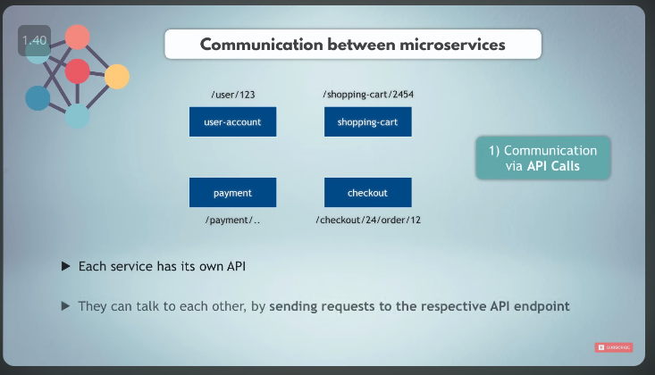
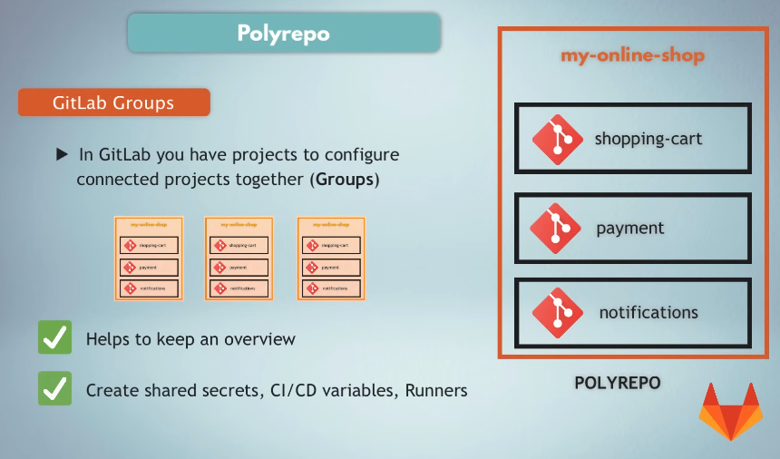

## Microservices explained - the What, Why and How?

[video](https://www.youtube.com/watch?v=rv4LlmLmVWk)

In this video i'm going to talk about microservices:

**i)** First i'm going to start by explaining what a monolith application architecture is.

**ii)** What were some of the challenges of a monolith architecture and why the industry moved slowly towards the microservices architecture.

**iii)** We will see what microservices or microservice architecture is exactly as well as best practices benefits and how the communication between microservices actually works.

**iv)** We will also see different ways to manage code for microservices application and talk about `monorepo` versus `polyrepo` and `advantages and disadvantages of both.`

# `1. Monolithic Architecture: `

Before microservices the standard way of developing applications was with a `monolithic architecture` this means all the components of the application the whole code basically is `part of a single unit` . For example if we had an online shop application all of its parts like the user authentication, shopping cart, product catalog ,sales campaigns, notification and so on all the code for these functionalities would be in one code base as part of one monolithic application.Some characteristics of monolithic application is given below: 

**i)** Everything is developed deployed and scaled as one unit this means the application must be written in a single language with one technology stack with a single runtime.

**ii)** If you have different teams working on different parts of the application they will need to coordinate to make sure they don't affect each other's work. If developers change code for payment functionality you would need to build the whole application and deploy they it as one package.So, You can't just update and deploy only the payment functionality changes separately.

So this was a standard way of developing applications but as applications grew in size and complexity this led to different challenges,

**i)**  First of all the coordination between teams became more difficult because the code was much bigger and the parts of the application were more tangled into each other also if suddenly you had a usage spike in shopping cart for example on holiday dates and you would want to scale only that part of the application you can't do it you need to scale the whole application.this in turn means higher infrastructure costs and less flexibility in scaling your application up and down. 

**ii)** Another issue is for example if a payment functionally used a third-party module with a version 1.8 while notifications featured needed the same module but required the version 1.7 instead in a monolith application you would have to pick one or the other because it's a single application and you can only have one dependency of the same module.

**iii)** Another major issue with monolith applications is that the release process of such applications takes longer because for changes in any part of the application in any feature you need to test and build the whole application to deploy those changes and the answer to all these issues was a microservices architecture.

# `2. MicroServices Architecture: `

What is microservices exactly is microservices? We break down the application in essentially multiple smaller applications. So, we have several small or micro applications that make up this one big application. Now, we have a couple of very important questions when we create a microservices architecture.

**i)** First of all how do we decide how to break down the application?
**ii)** What code goes where and how many such micro applications or microservices do we create?
**iii)** How big or small should these microservices be and finally how do these services then talk to each other.

### **ANS:**

First of all, the best practice is to break down the application into components or into microservices based on the `business functionalities` and not technical functionalities. Like, the microservices of an online shop application will be products, shopping, cart ,user accounts, checkout and so on. Because all these are basically business features and in terms of the size each micro service must do just one isolated thing. So, you should have a micro service that is responsible for shopping cart logic and the checkout you should always strive to keep one service doing one specific job. A very important characteristic of each microservice is that they should be self-contained and independent from each other this means each service must be able to be developed deployed and scaled separately without any tight dependencies on any other services even though they are part of the same application and this is called `lose coupling`.

So, with this best practice approach if you change something in the payment service you will only build and deploy the payment service nothing else will be affected and this means the services have their own individual versions which are not dependent on others. So if i release one service, i don't need to release any other service so the this release cycle has to be completely independent.

# `3: Communication Between Services (Microservice)`

These services are isolated and self-contained how do they connect to each other because obviously the `payment service` will need something from the `user account` to process the payment or the `checkout service` will need something from the `shopping cart`.A very common way for microservice communication is using `api calls`. 

So each service has an endpoint on which it accepts requests from other services so services can talk to each other by sending each other http requests on these endpoints. This is a synchronous communication where one service sends a request to another service and waits for the response. `So the user account service can send an http request to payment service on its api endpoint and vice versa`. Another common way of communication between microservices is `using a message broker with an asynchronous communication.`

Here services will send messages first to the intermediary message service or a broker such as `rabbitmq for example`, and then the message broker will forward that message to the respective service. So, again user account will send the message to the broker saying please pass this message on to the payment service and message broker will then forward that message to the payment service. And a third way of communication between microservices which is becoming pretty popular especially in the field of kubernetes is using a service mesh.With service mesh

You have kind of a helper service which takes over the complete communication logic so you don't have to code this logic into the microservices and have this communication logic kind of delegated to this external service .

These are different communication options and since the services are all isolated and talk to each other either with api calls or using additional services you can even develop each service with a different programming language and you can have dedicated teams for each service that can choose their own technology stack and work on their service without affecting or being affected by other service teams and this is exactly the most important advantage of microservices architecture compared to the monolith.

# `Downside of Microservices: `

However, these benefits come with the prices. So while microservices made developing and deploying applications easier in many aspects it also introduced some other challenges `that weren't there` before. When you break down the application into these multiple pieces this introduces a lot of complexities and challenges. One of the main complexities may be configuring the communication part between the services because a micro service may be down or unhealthy and not responding. While another service starts sending requests to its api expecting a fulfilled response in which case you may get unexpected results. Also with microservices deployed and scaled separately it may become difficult to keep an overview and find out when a microservice is down or which service is actually down. When something in the application is not working properly, so you definitely need a proper configuration of your application setup and its pieces to make sure your application as a whole functions well. But there are various tools for making all this easier. Even though the microservices architecture is complex there are a lot of tools and still more being developed regularly to make running microservices applications easier. The most popular one you probably already know is `kubernetes`. Which is a perfect platform for running large microservices applications.

# `4. CI/CD Pipeline for Microservices: `

Let's move on now obviously an important element of deploying microservices is a ci/cd pipeline. In fact, there are many companies with microservices applications that deploy multiple times a day. Companies like amazon google and netflix they have
applications with hundreds of microservices that they deploy thousands of times per day. So you can imagine the complexity and the sophistication of their CI/CD pipelines.So, in the modern world and workplace you will be most probably working with microservices and in this case you would need to know how to configure release process with a ci/cd pipeline for microservices.

# `5. Monorepo vs Polyrepo: `

We said microservices is when application components get developed and deployed separately as individual micro applications.`So, the question is how do we manage the code for microservices application in a git repository or like gitlab for example . ` With one project it's simple we just have one application and it gets its own git repository.

With microservices application we have two options for how the code is managed one is `monorepo` which stands for single repository and `polyrepo` also multi-repository. 

### `MOnorepo: `

So, monorepo or single repository is having one gitlab repository for all the services so we would create one project for a monorepo. So what's the difference here or how do we structure multiple micro applications inside one application repository. Well a common way is using folders. So, you have folders for each service like shopping,cart,payment, notifications etc. and all the code for those services are in those respective folders and having a mono repo meaning all the services still in one repository makes the code management and development easier. Because you only have to clone and work with one repository. So, it simplifies things plus if you have some shared code between the services like kubernetes manifest templates or helm chart or docker compose whatever you can put them in the root of the project and all the services can basically reuse them.

### `Disadvantage of Monorepo: `

**i)** Monorepo also comes with some challenges as i mentioned the most important criterion(মানদণ্ড) of microservices is to be completely independent and isolated so no tight coupling between the services inside the code. It becomes easy to break this criterion when you have a monorepo so you have junior developers with less experience in the monorepo setup it's easier to make such mistakes and develop tightly coupled logic or code in your services.

**ii)** Another downside of monorepo is when the application becomes really big then cloning, fetching and pushing becomes slow because your project is huge and in terms of the CI/CD pipeline. In most of the CI/CD platforms like gitlab CI/CD or jenkins you can only create one pipeline for one project. So, you are building multiple services with a single project pipeline. That means you need to add additional logic in your pipeline code that makes sure to only build and deploy the service which has changed so if you make code changes in the payment service your pipeline code should detect that and only that service should be built tested and deployed. It is possible to do that but it's a little bit more challenging. One more issue with a monorepo is that since you have just one main branch because you have one repository if developers of one of the services break the main branch other services and their pipelines will be blocked as well. But there are a lot of companies including very big ones like google who actually use monorepo for their applications. 

### `Polyrepo: `

The second option which is probably a bit more preferred one is polyrepo or multiple repositories. With this approach for each service we create a separate git project so the code is completely isolated. You can clone and work on them separately because they are in separate repositories. Now, even though they are separate application repositories they are still part of this bigger application. So of course you would want to still have some kind of connection of these repos for an easy management and overview. So, if you're hosting your code repositories on gitlab for example you can use gitlab's feature of groups in order to group code for all the microservices that belong to the same application in one group to make managing those repositories easier. So, essentially you would create a gitlab repository group for your application called `my online shop(In the picture showing up)` and inside this group you can create a separate project for each microservice that belongs to that application. If your company has multiple microservices applications of course this will help keep an overview of what projects belong together but also within the group you can actually create secrets or other ci/cd variables that can be shared by all the projects in that group. Now what about the ci/cd pipeline for a polyrepo?  

Well for polyrepo the ci/cd configuration is more straightforward because you just have own pipeline for each repository. So no extra logic is needed to differentiate between the services now of course everything has advantages and disadvantages. so for
polyrepo as well you have some downsides.

### `Disadvantage of Polyrepo: `

Like having application code in multiple repositories can make working on the project as a whole harder especially if you need to change two or more services at once because a feature or bug fix affects multiple services. If you need to switch between the services often this can also be tedious plus things like searching something across multiple projects from the code editor can be difficult or impossible also in the polyrepo you can't really share files in the project like kubernetes or hell manifest docker compose and so on you would either have to duplicate them in each project's repository or have to create a dedicated project and reference them from there . 

 

---
---

So, as you see both options have their advantages and disadvantages but the general rule is that if you have a small project with just a several microservices you should stick to monorepo and save the overhead of creating and managing and checking out multiple repositories. On the other hand, if you have separate teams for each service if you want to have complete isolation smaller code base to clone on pipelines and so on then of course the polyreport would be a better option.

---
---

