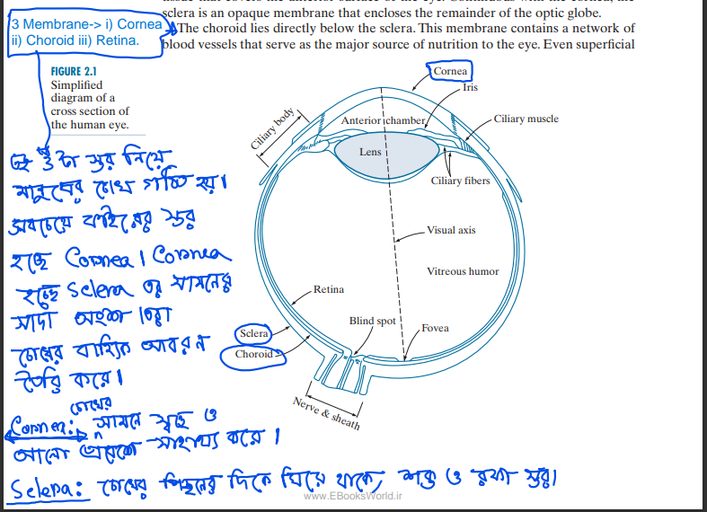
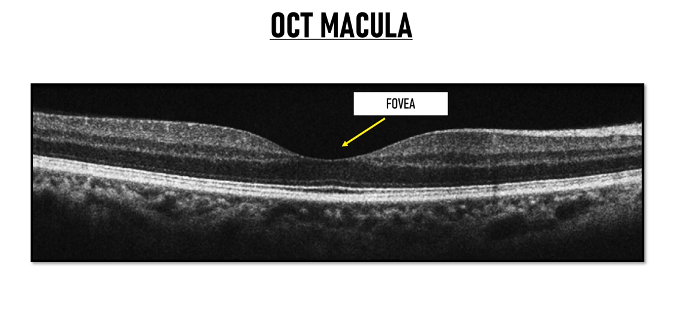
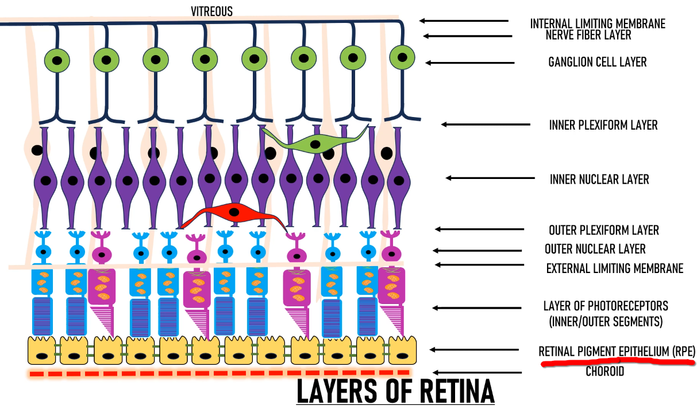
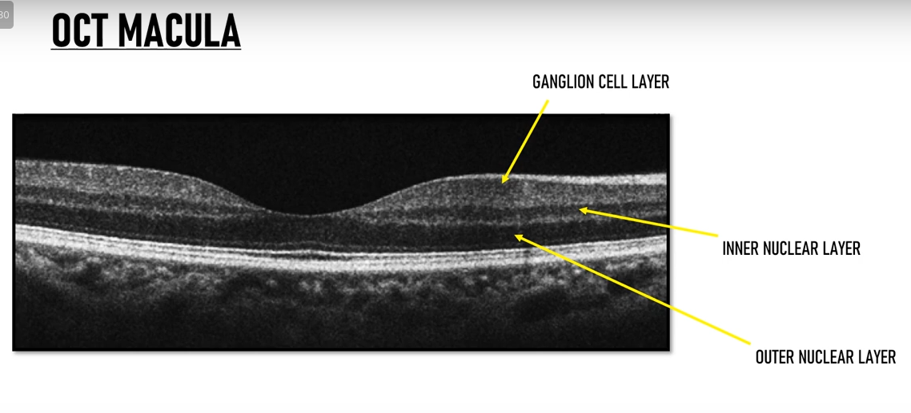
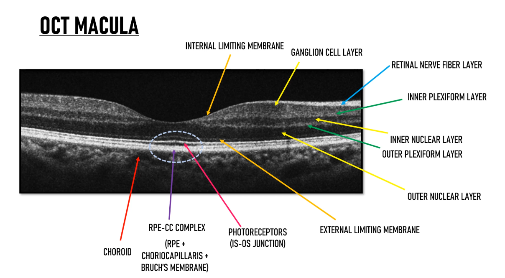
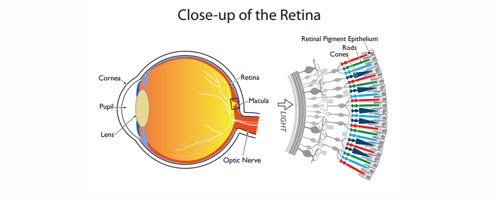

 
 
 

`There are two types of receptors in retina: cones and rods. There are between 6 and 7 million cones in each eye. They are located primarily in  the central portion of the retina, called the **fovea**, and are highly sensitive to color.`

 

# **Fovea in OCT Image:**

 

 

## **Choroid থেকে যদি retina এর ভিতরের দিকে যেতে থাকি তাহলে ১০ টা লেয়ার পাবো ।**

 

## **NUCLEAR LAYER IN OCT (dark layer):** 

 

## **Bright layer with dark layer**

`এখানে, photo মানে আলো, photoreceptor হলোঃ আলো কে receive করা ROD and CONE CELL.`

 

# **# What should be our apportch for solving this problem:**

**Pre-Trained CNN Models for OCT:**
`Studies show that models like VGGNet, ResNet, and InceptionNet are commonly fine-tuned for OCT image classification. These models, originally trained on general images, are adjusted to handle OCT-specific tasks like detecting retinal diseases. For example, ResNet50 and VGG16 have been used for classifying conditions like diabetic macular edema (DME) and age-related macular degeneration (AMD).`

**Specific Models Trained on OCT Datasets:**

- Beyond fine-tuning, some studies have developed models specifically trained on OCT datasets, leveraging self-supervised learning or custom architectures. For example:

-  A study introduced an Optimized Compact Convolutional Transformers (OCCT) model,   derived from Compact Convolutional Transformer (CCT), achieving 97.09% accuracy on a dataset of 130,649 OCT images after GAN augmentation 

- This model was compared with transformer-based models, including Swin Transformer.
Another research presented a foundation model, RETFound, trained on large-scale unlabelled retinal images (including 736,442 OCTs) using self-supervised learning, showing generalizability across various disease detection tasks**

